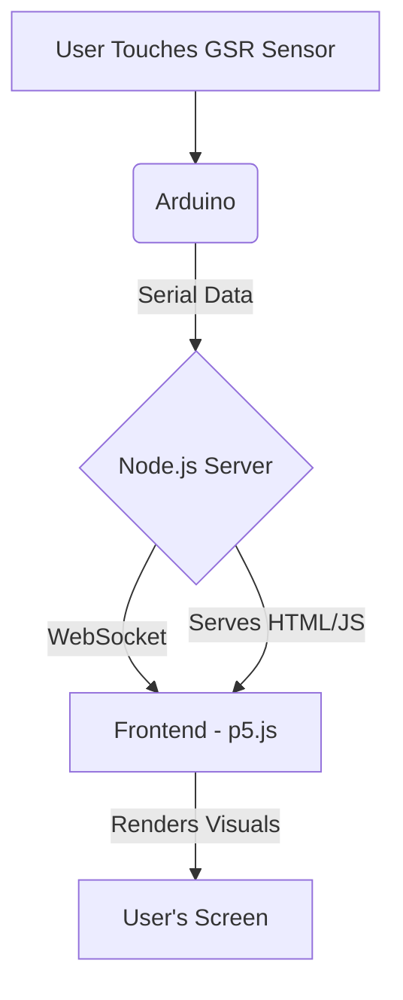

# Cupid: Interactive GSR Data Visualizer

Cupid is an interactive art project that captures and visualizes Galvanic Skin Response (GSR) data in real-time. The project uses an Arduino and a GSR sensor to measure a user's physiological state, which is then translated into a generative, halftone-style visual on a web browser.

The system follows a distinct interaction flow: it waits for a user to touch the sensor, measures their GSR for a short period, and then displays a final "result" visualization based on the collected data before entering a cooldown phase.

## Features

-   **Real-time Data Visualization:** Live generative art powered by physiological data.
-   **State-Driven Interaction:** The visualization changes dynamically through `IDLE`, `MEASURING`, and `RESULT` states.
-   **Automatic Hardware Detection:** The Node.js server automatically finds and connects to the Arduino.
-   **Configurable Visuals:** A GUI allows for real-time tweaking of the visual parameters (toggle with the 'v' key).
-   **WebSocket Communication:** Robust, real-time communication between the server and the browser.

## System Architecture

The project consists of three main components that work together:

1.  **Arduino:** Reads analog data from the GSR sensor.
2.  **Node.js Server:**
    -   Serves the frontend web page.
    -   Automatically detects and connects to the Arduino via a serial port.
    -   Forwards the serial data to the frontend using WebSockets.
3.  **Frontend (p5.js):**
    -   Connects to the server via WebSocket.
    -   Receives GSR data and updates the visualization state and parameters accordingly.



## Required Hardware

-   Arduino Uno (or a compatible board)
-   GSR (Galvanic Skin Response) Sensor
-   Jumper wires

## Required Software

-   [Arduino IDE](https://www.arduino.cc/en/software)
-   [Node.js](https://nodejs.org/) (which includes npm)

## Setup and Installation

### 1. Hardware Setup

1.  Connect the GSR sensor to your Arduino. The default pin in the sketch is `A3`.
    -   **Signal/SIG** → `A3` on Arduino
    -   **VCC/+** → `5V` on Arduino
    -   **GND/-** → `GND` on Arduino
2.  Connect the Arduino to your computer via USB.

### 2. Upload Arduino Sketch

1.  Open the `hug_workshop_1/hug_workshop_1.ino` file in the Arduino IDE.
2.  Go to **Tools > Board** and select your Arduino board (e.g., "Arduino Uno").
3.  Go to **Tools > Port** and select the port your Arduino is connected to.
4.  Click the **Upload** button.

### 3. Run the Server

1.  Open a terminal and navigate to the root directory of the project.
2.  Install the required Node.js packages by running:
    ```bash
    npm install
    ```
3.  Start the server:
    ```bash
    node server.js
    ```
    The server will automatically look for the Arduino and connect to it. You should see a confirmation message in the terminal.

### 4. View the Visualization

1.  Once the server is running, open a web browser and navigate to:
    [http://localhost:3000](http://localhost:3000)
2.  The visualization should appear in its `IDLE` state. You can press the `v` key to toggle the controls panel.

## How It Works

The system operates on a simple state machine driven by the Arduino:

1.  **IDLE:** The visualization is in a calm, ambient state. The Arduino waits for the GSR sensor reading to pass a certain threshold, which indicates a user is touching it.
2.  **DETECTING & MEASURING:** Once a user's touch is detected for 2 continuous seconds, the Arduino sends a `0` to the server. The frontend enters the `MEASURING` state, changing the visuals to indicate that data is being collected. This phase lasts for 15 seconds.
3.  **RESULT:** After 15 seconds, the Arduino calculates the average GSR value and sends it to the server. The frontend receives this value and transitions to the `RESULT` state, displaying a unique, static visualization based on the data. The final score is also displayed at the bottom of the screen.
4.  **COOLDOWN:** The system remains in the `RESULT` state for 40 seconds, after which it automatically transitions back to the `IDLE` state, ready for the next interaction.
